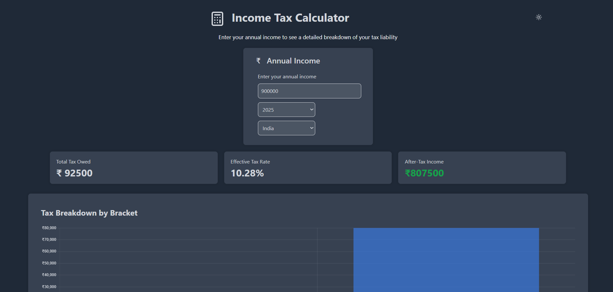

# 🧮 Income Tax Calculator

A web app to calculate income tax based on user input and selected country. Supports tax brackets for multiple countries and years.


## 🖼️ Screenshot



## 🌐 Live Demo

[View App](https://tax-calculator-zeta-six.vercel.app/)


## ⚙️ Installation

```bash
git clone https://github.com/Rajarsee295/tax-calculator.git
npm install
npm run dev
```

## 🚀 Usage

- Enter your annual income.
- Select the year and country.
- View your tax breakdown, effective tax rate, and after-tax income.
- Download a PDF report.


## ✨ Features

- Tax calculation for India, USA, UK, France, and Australia.
- Support for tax years 2015–2025.
- PDF export.
- Dark mode support.
- Interactive charts


## 🛠 Technologies Used
- React + Vite
- Tailwind CSS
- Chart.js
- html2canvas + jsPDF
